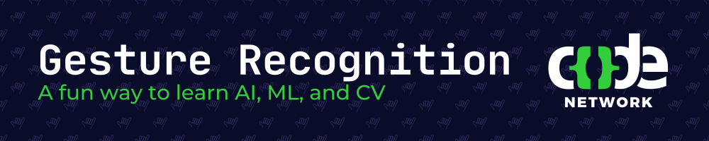

[](https://huggingface.co/datasets/CNGR/CN_Gesture_Recognition)

# GestureRecognition

A Code Network **Gesture Recognition Software** project implemented in **Python** for recognizing and classifying hand gestures using computer vision and machine learning techniques.

## 📌 Features

- Real-time hand gesture detection using OpenCV.
- Machine learning model for gesture classification.
- Custom dataset creation for training.
- Live visualization of recognized gestures.
- Modular and extensible architecture.

### ✋ Gestures Recognised

| Gesture | Example | Gesture | Example |
| ------- | --------| ------- | --------|
| Thumbs up |  | Thumbs down |  |
| Horns Sign |  | Vulcan Salute |  |
| Palm/Stop |  | Fist Bump |  |
| Fist |  | Peace |  |
| Heart Fingers |  | Heart Hands |  |
| Chef's Kiss |  | Okay |  |

## 🚀 Installation

1. Clone the repository:

   ```bash
   git clone https://github.com/codenetwork/gestureRecognition.git
   ```

2. Create a virtual environment and install dependencies:

   ```bash
   python -m venv venv
   source venv/bin/activate  # On Windows use `venv\Scripts\activate`
   pip install -r requirements.txt
   ```

## 🖥️ Usage

### Running Gesture Recognition

Run the main script to start recognizing gestures in real-time:

```bash
python gesture_recog.py
```

## 🛠️ Technologies Used

- **Python** (Programming Language)
- **OpenCV** (Computer Vision)
- **YOLO** (Machine Learning Model)

## 🧪 Methodology

### Two different models will be trained. One will be a YOLO model and the other will be a CNN model

1. **Data Collection**: Capturing hand gestures using photos on phones.
2. **Data Annotation/Preprocessing**: Extracting key hand landmarks/Processing data for training.
3. **Model Training**: Using a neural network to identify/classify gestures.
4. **Real-time Prediction**: Integrating the trained model for live recognition.

## 🌟 If You Are Interested

If you have the following skills or if you are simply looking to learn, here's how you can contribute:

- **Python Basics**: If you're learning Python, start by looking at simple scripts and trying to understand how they work. You can help by cleaning up code, adding comments, or fixing small issues.
- **Data Collection**: If you're interested in data science, try capturing different gestures in different environments and use them to train the model.
- **Machine Learning**: Learn about leveraging certain machine learning models. Help improve the model accuracy, experiment with the model architecture, optimize performance, change hyperparameters or identify alternative methodologies.
- **Testing & Debugging**: Run the project, see if you encounter any issues, and report them. Even better, try to find small bugs and suggest fixes.
- **Implementation**: Implementing machine learning into a real-world context.
- **Documentation**: Improving explanations in the README, adding beginner-friendly guides, or fixing typos can be a huge help.

Feel free to contribute and enhance this project!
